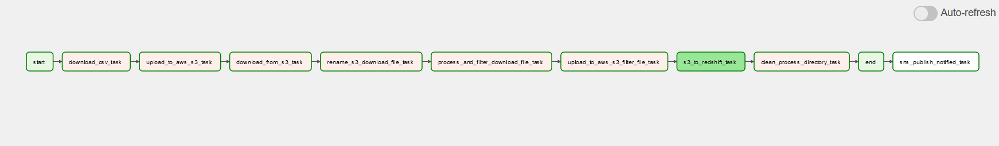
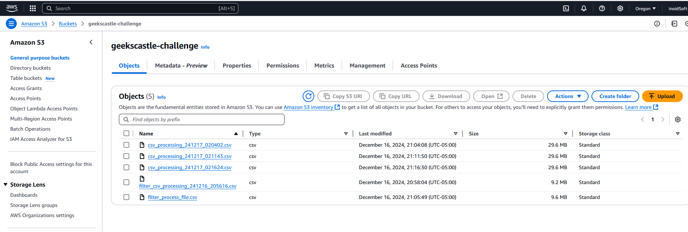
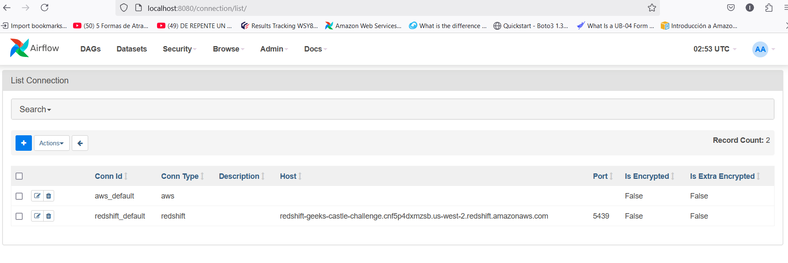
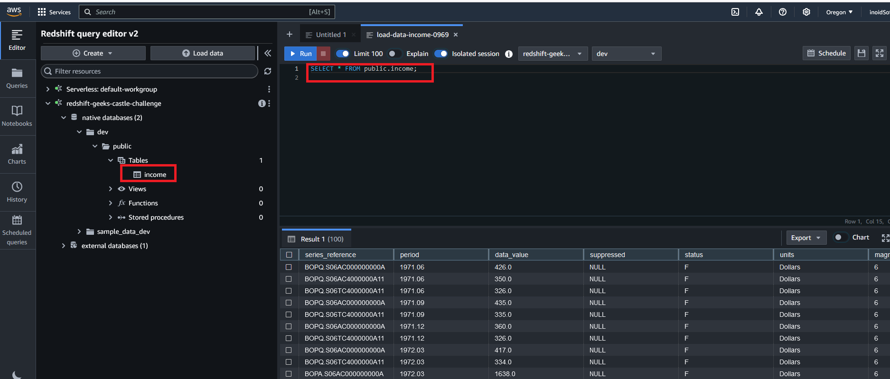

# Descripción del proyecto:

  Pipeline de datos usando Apache Airflow

#### Requisitos:

- Diseñar un pipeline de datos utilizando Apache Airflow o AWS Step Functions:
  - Paso 1: Descargar un archivo desde una URL proporcionada.
  - Paso 2: Procesar el archivo (similar al procesamiento en la Parte 2).
  - Paso 3: Subir los resultados procesados a un bucket S3.
  - Paso 4: Notificar mediante SNS al finalizar.

#### Criterios de Evaluación:
 - Diseño claro y modular del pipeline.
 - Implementación de dependencias entre pasos.
 - Documentación clara del pipeline.

### Diseño del Pipeline

 Se creo un workflow de Airflow (DAG) con 11 tareas. La definición de las Dag y sus Task se encuentran en el archivo `dags/airflow_pipeline.py`. 

  4
  - start: Primera tarea que inicia el Workflow.
  - download_csv_task: Descarga el archivo csv de la url.
  - download_csv_task: Subir a un bucket de S3 del archivo csv.
  - download_from_s3_task: Descargar el archivo csv del bucket de S3.
  - rename_s3_download_file_task: Renombrar el archivo csv descargado.
  - process_and_filter_download_file_task: Aplicar un filtro a los datos presentes en el csv.
  - upload_to_aws_s3_filter_file_task: Subir el archivo csv filtrado a un bucket S3.
  - s3_to_redshift_task: Copiar el archivo csv en el Bucket S3 a una base de datos RedShift.
  - sns_publish_notified_task: Limpiar archivos no utilizados.
  - end: Última tarea del workflow.
  - sns_publish_notified_task: Ejecutar el envio de notificaciones de la finalizacion del pipeline.

###  Descripción de la instalación y el despliegue

1. Se uso una imagen de docker de Airflow para desplegar el pipeline. Para más información [ver](https://airflow.apache.org/docs/apache-airflow/stable/howto/docker-compose/index.html).

1. Es necesario un usuario AWS y obtener las claves de acceso:  

   - AWS_SECRET_ACCES_KEY
   - AWS_ACCESS_KEY_ID
   - AWS_DEFAULT_REGION

    Obtener los valores de usuarios IAM asociados y copoar en las variables de ambiente del archivo docker-compose.yaml.

1. Fue creado un bucket S3 para el mismo usuario AWS. Se debe crear un bucket S3 y define la variable de Airflow de nombre AWS_S3_STORE_BUCKET_NAME.

   

1. Fue descargado un [archivo csv de la url](https://www.stats.govt.nz/assets/Uploads/Balance-of-payments/Balance-of-payments-and-international-investment-position-June-2024-quarter/Download-data/balance-of-payments-and-international-investment-position-june-2024-quarter.csv), si se modifica la dirección de la url definida en la variable de Airflow llamada `EXTERNAL_URL_CSV`. Entonces se tiene que modificar la tarea que filtra el csv llamada
`process_and_filter_download_file_task` en el archivo **dags/airflow_pipeline.py**  con las columnas y criterios de filtro csv. Si se modifica `EXTERNAL_URL_CSV` por otro archivo csv u otro tipo de datos, no somos responsables del resultado.

1. It's importan too, create a aws_default conection with your `AWS_SECRET_ACCES_KEY` and 

    Es importante también, crear una conexión de Airflow de nombre `aws_default` con el 
`AWS_ACCESS_KEY_ID` con los mismos valores de los usuarios que se establecieron en el docker-compose.yaml. 
Para más información [ver este enlace](https://airflow.apache.org/docs/apache-airflow-providers-amazon/stable/connections/aws.html). 

   

1. Despliegue de las imagenes de Docker:
   En el directorio `airflow_aws_data_pipeline` se debe ejecutar:
      
      `docker compose up` 

    Es importante revisar antes que el archivo docker-compose.yaml

1.  Se debe crear una base de datos RedSfhit con una configuración de cluster. En la base de datos definida se debe crear una tabla de nombre `income` con las mismas características de las columnas que en el 
[archivo csv](https://www.stats.govt.nz/assets/Uploads/Balance-of-payments/Balance-of-payments-and-international-investment-position-June-2024-quarter/Download-data/balance-of-payments-and-international-investment-position-june-2024-quarter.csv).
Se puede tener la tabla DDL en [table_ddl/income_table.sql](files/table_ddl.sql).  
Es un requerimiento el nombre de la tabla `income`, con el esquema public.

      
1. Para la conexión con la base de datos RedShift se necesita crear la conexión de Airflow de nombre **redshift_default**  con la información de su cluster RedShift. Para mas información [ver](https://www.astronomer.io/docs/learn/airflow-redshift/). 

    También es necesario configurar el cluster de la bases de datos RedShift para permitir conexiones externas. Para más información [ver](https://docs.bigeye.com/docs/redshift).

1. Was created an Amazon Simple Notification Service (Amazon SNS) notificator for send email, if you want 
received notification when workflow (pipeline) finalized, contact to developer team.

    Fue creado un notifiador de tipo Amazon Simple Notification Service (Amazon SNS) para enviakr un email, se se desea recibir las notificaciones cuando el pipeline del workflow ha terminado  [image](doc/image/sns_aws_topic.png).

